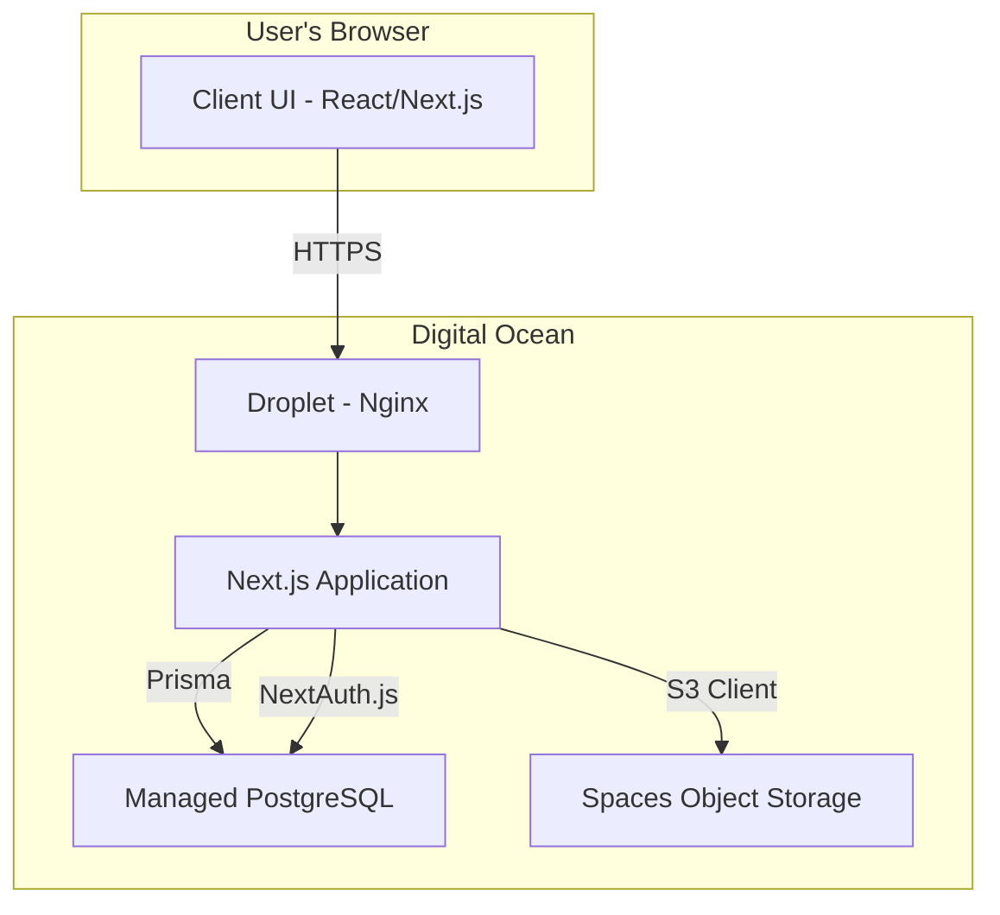

# Aigrowise NDVI Hub Fullstack Architecture Document

### **Section 1: Introduction**

This document outlines the complete fullstack architecture for the Aigrowise NDVI Hub, including backend systems, frontend implementation, and their integration. It serves as the single source of truth for all development.

#### **Starter Template or Existing Project**

The project will be based on the **T3 Stack**. This provides a well-structured, type-safe foundation that includes Next.js, TypeScript, Tailwind CSS, Prisma, and NextAuth.js, which will significantly accelerate development.

#### **Change Log**

| Date | Version | Description | Author |
| :--- | :--- | :--- | :--- |
| Aug 14, 2025 | 1.0 | Initial architecture draft | Winston (Architect) |

-----

### **Section 2: High Level Architecture**

#### **Technical Summary**

This project will be a full-stack, type-safe web application built using the T3 Stack. The architecture is centered on a **Next.js** application that serves both the frontend user interface and the backend API via serverless functions. Data will be managed through the **Prisma** ORM connecting to a **PostgreSQL** database, with authentication handled by **NextAuth.js**. This approach ensures end-to-end type safety, from the database to the user interface, creating a highly maintainable and robust system.

#### **Platform and Infrastructure Choice**

  * **Platform**: Digital Ocean
  * **Key Services**:
      * **Droplet**: For hosting the Next.js application.
      * **Managed PostgreSQL Database**: For reliable, scalable data storage.
      * **Spaces**: For object storage of NDVI images.

#### **Repository Structure**

The T3 Stack provides a **monorepo** structure out-of-the-box, which is the correct approach for this project, keeping all frontend, backend, and shared code in a single, manageable repository.

#### **High Level Architecture Diagram**



#### **Architectural Patterns**

  * **Full-stack Monorepo**: All code (frontend, backend, shared types) is located in a single repository for streamlined development.
  * **Serverless Functions for API**: The backend is composed of serverless API routes within Next.js, enabling scalability and simplifying backend management.
  * **ORM for Type-Safe Database Access**: Prisma provides a fully type-safe layer for all database interactions, preventing common data-related errors.
  * **Component-Based UI**: The frontend is built with React, using a modular and reusable component architecture.

-----

### **Section 3: Tech Stack**

| Category | Technology | Version | Purpose | Rationale |
| :--- | :--- | :--- | :--- | :--- |
| **Frontend Framework** | Next.js | 14.2.3 | Core framework for UI and API | T3 Stack default. Enables fast, server-rendered React applications. |
| **UI Library** | React | 18.2.0 | Building user interface components | T3 Stack default. The leading library for modern UI development. |
| **Styling** | Tailwind CSS | 3.4.1 | Utility-first CSS framework | T3 Stack default. Allows for rapid styling without writing custom CSS. |
| **Components** | Shadcn/ui | 0.8.0 | Composable component collection | Integrates perfectly with Tailwind for building custom UIs quickly. |
| **API Style** | tRPC | 10.45.2 | End-to-end typesafe APIs | T3 Stack default. Guarantees type safety between frontend and backend. |
| **Authentication** | NextAuth.js | 4.24.7 | Authentication for Next.js | T3 Stack default. Simplifies adding secure authentication. |
| **Language** | TypeScript | 5.4.5 | Superset of JavaScript | T3 Stack default. Provides essential type safety across the stack. |
| **Database** | PostgreSQL | 16.3 | Relational database | Our choice. Robust, reliable, and works well with Prisma. |
| **ORM** | Prisma | 5.12.1 | Next-generation ORM | T3 Stack default. Provides a type-safe database client. |
| **Testing** | Vitest | 1.5.0 | Unit and integration testing | A fast and modern testing framework compatible with our stack. |
| **CI/CD** | GitHub Actions | - | Automation and deployment | Tightly integrated with GitHub for a seamless CI/CD pipeline. |
| **Deployment** | Nginx / PM2 | 1.18 / 5.3.1 | Web server and process manager | Standard, reliable choices for deploying Node.js apps on a Droplet. |

-----

### **Section 4: Data Models**

#### **Model 1: User**

  * **Purpose**: To store client and administrator account information.
  * **Prisma Schema**:
    ```typescript
    model User {
      id        String   @id @default(cuid())
      email     String   @unique
      password  String
      role      Role     @default(CLIENT)
      images    Image[]
      createdAt DateTime @default(now())
      updatedAt DateTime @updatedAt
    }

    enum Role {
      CLIENT
      ADMIN
    }
    ```
  * **Relationships**: A `User` can have many `Images`.

#### **Model 2: Image**

  * **Purpose**: To store metadata about each uploaded NDVI image.
  * **Prisma Schema**:
    ```typescript
    model Image {
      id        String   @id @default(cuid())
      url       String
      user      User     @relation(fields: [userId], references: [id])
      userId    String
      createdAt DateTime @default(now())
    }
    ```
  * **Relationships**: An `Image` belongs to one `User`.

-----

### **Section 5: Components**

The system is broken down into these logical components:

  * **Web UI**: Renders the interface using Next.js, React, and Tailwind.
  * **API Layer**: Exposes business logic via tRPC.
  * **Authentication Service**: Manages sessions and roles using NextAuth.js.
  * **Database Service**: Manages data persistence using Prisma.
  * **Image Storage Service**: Handles file uploads to DigitalOcean Spaces.

-----

### **Section 6: API Specification (tRPC)**

The API is defined by type-safe tRPC routers for `auth` and `image` procedures, combined in a main `appRouter`. Procedures are protected using `publicProcedure`, `protectedProcedure`, and `adminProcedure` middleware to ensure correct access levels.

-----

### **Section 7: Database Schema**

This is the SQL that will be generated by Prisma to create the tables in PostgreSQL.

```sql
CREATE TYPE "Role" AS ENUM ('CLIENT', 'ADMIN');

CREATE TABLE "User" (
    "id" VARCHAR(255) PRIMARY KEY,
    "email" VARCHAR(255) UNIQUE NOT NULL,
    "password" VARCHAR(255) NOT NULL,
    "role" "Role" NOT NULL DEFAULT 'CLIENT',
    "created_at" TIMESTAMP WITH TIME ZONE NOT NULL DEFAULT NOW(),
    "updated_at" TIMESTAMP WITH TIME ZONE NOT NULL
);

CREATE TABLE "Image" (
    "id" VARCHAR(255) PRIMARY KEY,
    "url" TEXT NOT NULL,
    "user_id" VARCHAR(255) NOT NULL REFERENCES "User"(id) ON DELETE CASCADE,
    "created_at" TIMESTAMP WITH TIME ZONE NOT NULL DEFAULT NOW()
);

CREATE INDEX "Image_user_id_idx" ON "Image"("user_id");
```

-----

### **Section 8: Core Workflows**

Workflows like User Login and Admin Image Upload are mapped out, detailing the sequence of interactions between the UI, API, and various services to accomplish a task.

-----

### **Section 9: Unified Project Structure**

The project will use a standard T3 Stack monorepo structure, with the main Next.js application in `apps/nextjs/` and the Prisma schema in `packages/db/`.

-----

### **Section 10: Development Workflow**

Provides developers with all necessary commands and configuration to set up a local environment, including prerequisites (Node.js, pnpm, Docker), initial setup commands, and a `.env.example` file.

-----

### **Section 11: Deployment Architecture**

A continuous deployment pipeline using GitHub Actions will automate deployments to a DigitalOcean Droplet on every push to the `main` branch. The Droplet will run the application using PM2 and serve it securely via an Nginx reverse proxy.

-----

### **Section 12: Security and Performance**

Defines mandatory guidelines, including the use of `httpOnly` cookies for auth tokens, strict input validation with Zod, password hashing with `bcrypt`, and performance targets based on Core Web Vitals.

-----

### **Section 13: Testing Strategy**

The strategy follows the testing pyramid, using Vitest and React Testing Library for co-located component and API unit tests, and Playwright for end-to-end tests of critical user flows.

-----

### **Section 14: Coding Standards**

Defines a minimal but mandatory set of rules for AI developers, enforcing adherence to the T3 Stack's ESLint/Prettier configuration and critical patterns for type safety and database access.

-----

### **Section 15: Error Handling Strategy**

A unified strategy where tRPC API errors are transformed into a standardized JSON format that the frontend can gracefully handle by displaying user-friendly toast notifications.

-----

### **Section 16: Monitoring and Observability**

The production application will be monitored using Sentry for error tracking, DigitalOcean's built-in metrics for infrastructure health, and a `/api/health` endpoint for uptime checks.

