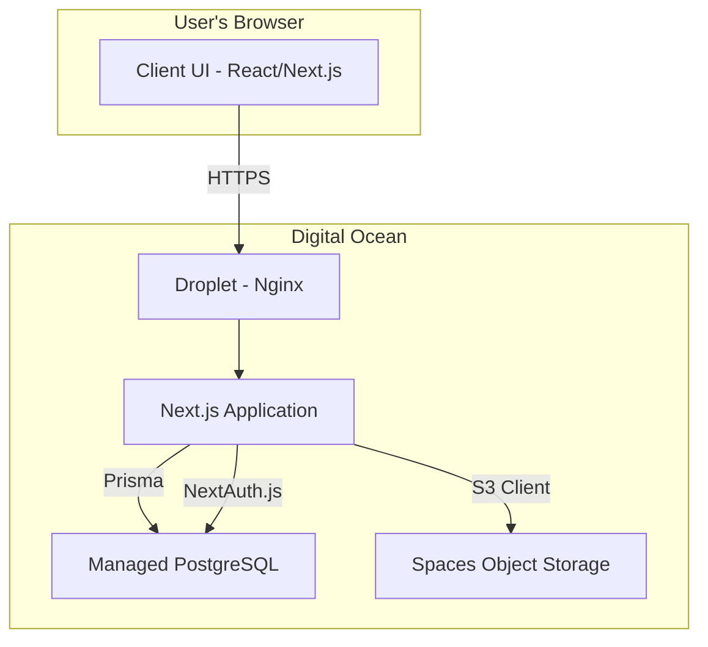

### **Section 2: High Level Architecture**

#### **Technical Summary**

This project will be a full-stack, type-safe web application built using the T3 Stack. The architecture is centered on a **Next.js** application that serves both the frontend user interface and the backend API via serverless functions. Data will be managed through the **Prisma** ORM connecting to a **PostgreSQL** database, with authentication handled by **NextAuth.js**. This approach ensures end-to-end type safety, from the database to the user interface, creating a highly maintainable and robust system.

#### **Platform and Infrastructure Choice**

* **Platform**: Digital Ocean
* **Key Services**:
  * **Droplet**: For hosting the Next.js application.
  * **Managed PostgreSQL Database**: For reliable, scalable data storage.
  * **Spaces**: For object storage of NDVI images.

#### **Repository Structure**

The T3 Stack provides a **monorepo** structure out-of-the-box, which is the correct approach for this project, keeping all frontend, backend, and shared code in a single, manageable repository.

#### **High Level Architecture Diagram**

#### **Architectural Patterns**

* **Full-stack Monorepo**: All code (frontend, backend, shared types) is located in a single repository for streamlined development.
* **Serverless Functions for API**: The backend is composed of serverless API routes within Next.js, enabling scalability and simplifying backend management.
* **ORM for Type-Safe Database Access**: Prisma provides a fully type-safe layer for all database interactions, preventing common data-related errors.
* **Component-Based UI**: The frontend is built with React, using a modular and reusable component architecture.

***
